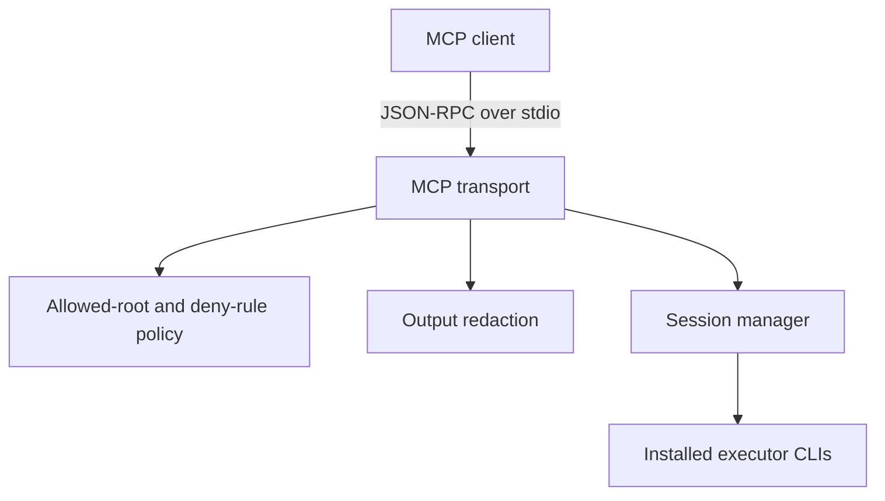

<div align="center">

# Agent CLI MCP Server

**Rust MCP server for dispatching and supervising external AI coding CLIs**

[](https://www.rust-lang.org)
[](https://modelcontextprotocol.io)
[](LICENSE)

</div>

## Scope

`agent-cli-mcp-rust` exposes external coding-agent CLIs through one MCP/JSON-RPC interface. It includes session management, allowed-root directory checks, destructive-command deny rules, and output redaction for common credential formats.

The repository contains dedicated integrations for GitHub Copilot CLI and Google Jules plus generic process adapters for other installed CLIs. External executors must be installed and authenticated separately.

## Current verification

- `cargo test` covers the directory-policy and redaction modules.
- CI runs `cargo check --all-targets` and `cargo test --all-targets` on the current stable Rust toolchain.
- The repository does not currently provide end-to-end CI against third-party executor services.
- No throughput, latency, or scalability benchmarks have been published.
- Tool availability and behavior depend on the locally installed executor versions.

This is a developer tool, not a hosted service or a security boundary by itself.

## Architecture



## Supported executor paths

| Executor | Integration |
|---|---|
| GitHub Copilot CLI | Dedicated commands for prompt, background runs, review, and session operations |
| Google Jules | Dedicated API/session operations |
| Gemini CLI | Generic process adapter |
| OpenAI Codex CLI | Generic process adapter |
| OpenCode CLI | Generic process adapter |
| Anthropic Claude CLI | Generic process adapter |

The table describes implemented adapter paths, not a guarantee that every upstream CLI version or account configuration will work unchanged.

## Security-related controls

- Allowed-root checks reject execution outside configured directories.
- Quarantine markers can block a directory.
- Mandatory deny patterns cover selected destructive commands such as force pushes and production deployment commands.
- Output redaction targets common database URLs, API keys, JWTs, and service tokens.

These controls are defensive checks, not a complete sandbox. Review the policy configuration before granting an agent access to sensitive repositories or credentials.

## Installation

### Prerequisites

- Current stable Rust toolchain
- At least one supported executor CLI installed on `$PATH`

```bash
git clone https://github.com/pappdavid/agent-cli-mcp-rust.git
cd agent-cli-mcp-rust
cargo build --release
```

Quick transport check:

```bash
echo '{"jsonrpc":"2.0","id":1,"method":"initialize","params":{"protocolVersion":"2025-03-26","capabilities":{},"clientInfo":{"name":"test","version":"0.1.0"}}}' \
  | ./target/release/agent-cli-mcp-rust 2>/dev/null | head -1
```

## Configuration

```bash
cp config.json ~/.agent-cli-mcp/config.json
export AGENT_CLI_CONFIG=~/.agent-cli-mcp/config.json
```

| Field | Default | Purpose |
|---|---|---|
| `allowedRoots` | `~/Dev,~/projects` | Directories the server may operate in |
| `stateDir` | `~/.agent-cli-mcp` | Run logs and session state |
| `defaultTimeoutMs` | `1800000` | Executor-process timeout |
| `maxOutputChars` | `50000` | Maximum returned output per tool call |

## Main tool groups

- Discovery and health: overview, capability probing, executor checks
- Execution: one-shot runs, background runs, interactive sessions, input/output, termination
- Jules operations: create sessions, approve plans, send feedback, request verification
- Repository utilities: worktrees, sanity checks, quarantine, artifact collection

The exact tool schema is defined in the source and may evolve with the executor adapters.

## Development

```bash
cargo test
cargo check --all-targets
cargo fmt --check
```
