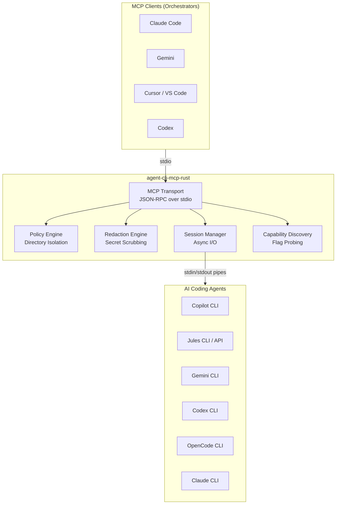
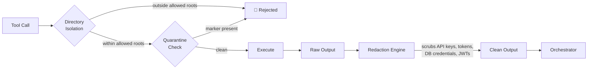

<div align="center">

# Agent CLI MCP Server

**High-performance multi-agent orchestration server in Rust**

[](https://www.rust-lang.org)
[](https://modelcontextprotocol.io)
[](https://github.com/features/copilot)
[](https://jules.google.com)
[](https://gemini.google.com)
[](LICENSE)

**One server. Six executors. Full bidirectional control.**

</div>

---

## What It Does

`agent-cli-mcp-rust` is an MCP server that lets any MCP-capable orchestrator (Claude Code, Cursor, Gemini, etc.) drive multiple AI coding agents through a single unified interface — with built-in directory isolation, secret redaction, tool permission profiles, and session management.

---

## Supported Executors

| Executor | Binary | Support Level |
|---|---|---|
| **GitHub Copilot CLI** | `copilot` | Full — prompt, autopilot, fleet, delegate, review, keep-alive |
| **Google Jules** | `jules` | Full — remote sessions, plan approval, API mode, verification |
| **Gemini CLI** | `gemini` | Generic — prompt, interactive, run |
| **OpenAI Codex CLI** | `codex` | Generic — prompt, interactive, run |
| **OpenCode CLI** | `opencode` | Generic — prompt, interactive, run |
| **Anthropic Claude CLI** | `claude` | Generic — prompt, interactive, run |

---

## Architecture



---

## Security Model



**Mandatory deny overlay** — always blocked regardless of profile:

- `memory` writes
- `vercel deploy --prod`
- `supabase db reset`
- `git push --force`
- `security find-generic-password` (macOS Keychain)

---

## Tool Permission Profiles

| Profile | Use Case |
|---|---|
| `copilot-file-edit` | Scoped file edits only |
| `copilot-safe-dev` | Dev commands + file edits |
| `copilot-expanded-worktree` | Full worktree access |
| `copilot-target-repo` | Full repo with build tools |

---

## Tech Stack

<div align="center">

&nbsp;


</div>

---

## Installation

### Prerequisites

- **Rust 1.75+** — install via [rustup](https://rustup.rs)
- At least one supported executor CLI on your `$PATH`

### Build

```bash
git clone https://github.com/pappdavid/agent-cli-mcp-rust.git
cd agent-cli-mcp-rust
cargo build --release
# Binary: target/release/agent-cli-mcp-rust
```

### Quick Verify

```bash
echo '{"jsonrpc":"2.0","id":1,"method":"initialize","params":{"protocolVersion":"2025-03-26","capabilities":{},"clientInfo":{"name":"test","version":"0.1.0"}}}' \
  | ./target/release/agent-cli-mcp-rust 2>/dev/null | head -1
```

---

## Configuration

```bash
cp config.json ~/.agent-cli-mcp/config.json
export AGENT_CLI_CONFIG=~/.agent-cli-mcp/config.json
```

Key fields:

| Field | Default | Description |
|---|---|---|
| `allowedRoots` | `~/Dev,~/projects` | Directories the server may operate in |
| `stateDir` | `~/.agent-cli-mcp` | Run logs and session tracking |
| `defaultTimeoutMs` | `1800000` | Executor process timeout (30 min) |
| `maxOutputChars` | `50000` | Max chars returned per tool call |

---

## Register with MCP Clients

**Claude Code / Claude Desktop** — add to `~/.claude/settings.json`:

```json
{
  "mcpServers": {
    "agent-cli": {
      "command": "/path/to/agent-cli-mcp-rust",
      "env": {
        "AGENT_CLI_ALLOWED_ROOTS": "~/Dev",
        "AGENT_CLI_CONFIG": "~/.agent-cli-mcp/config.json"
      }
    }
  }
}
```

---

## Tool Reference

### Discovery & Health

| Tool | Description |
|---|---|
| `agent_cli.overview` | Compact dashboard of all agent activity |
| `agent_cli.capabilities` | Probe CLIs for supported flags and versions |
| `agent_cli.executor_health` | Health check across all executors |
| `agent_cli.test_executor_profile` | Smoke-test a tool permission profile |

### Execution

| Tool | Description |
|---|---|
| `agent_cli.run` | One-shot dispatch (waits for completion) |
| `agent_cli.run_quick` | Short-lived run with immediate output |
| `agent_cli.start_run` | Background run (returns immediately) |
| `agent_cli.start_session` | Long-running interactive session |
| `agent_cli.send_input` | Write to session stdin |
| `agent_cli.read_output` | Read captured stdout/stderr |
| `agent_cli.list_sessions` | List runs and active sessions |
| `agent_cli.kill_session` | Terminate a running process |

### Jules-Specific

| Tool | Description |
|---|---|
| `jules.create_session` | Create a Jules API session |
| `jules.approve_plan` | Approve the latest plan |
| `jules.send_message` | Send feedback to a session |
| `jules.request_verification` | Ask Jules to verify results |
| `jules.pending_actions` | Sessions needing attention |

### Infrastructure

| Tool | Description |
|---|---|
| `agent_cli.create_worktree` | Create isolated git worktrees |
| `agent_cli.sanity_check` | Scan for mutations or leaks |
| `agent_cli.quarantine` | Freeze a directory |
| `agent_cli.collect_artifacts` | Collect executor outputs |

---

## Development

```bash
cargo test          # Run tests
cargo fmt           # Format code
cargo clippy        # Lint
RUST_LOG=debug cargo run  # Run with debug logging
```
